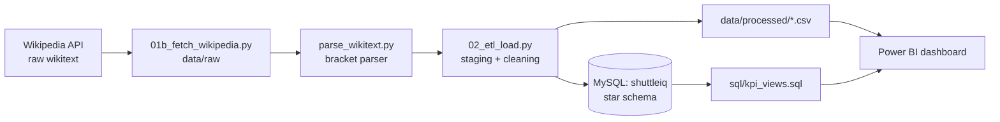
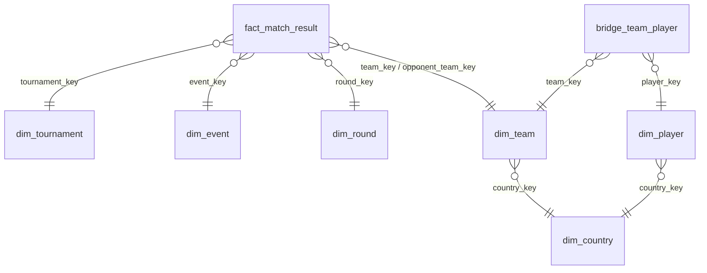

# ShuttleIQ - Business Intelligence for Badminton Performance Analytics

**Course:** 23UDSPEL4704A Business Intelligence - TAE 2 (Phase II), G H Raisoni College of Engineering and Management, Pune
**Team:** [Student 1 Full Name] (Roll/PRN: ...) and [Student 2 Full Name] (Roll/PRN: ...) - GitHub: `payalkakad01`
**Submitted to:** Prof. Chinmay Mukim

## 1. Problem statement and business value
Badminton federations, national coaches and analysts make selection, seeding and training decisions from
scattered match reports. ShuttleIQ turns the raw match data of the **BWF World Championships 2025 (Paris) and 2026 (New Delhi)**
into a dimensional warehouse and an interactive dashboard that answers:
- Which countries and teams convert seeding into results, and where do upsets happen? (seed performance, upset rate)
- How competitive are the draws? (deciding-game rate, deuce rate, winning margin)
- How reliable is the draw? (retirement / walkover rate)
- Who wins medals, by country and continent? (medal table)

**Decision-makers:** national coaches, performance analysts, tournament organisers.

## 2. Data source and sourcing proof
| Item | Detail |
|---|---|
| Source | Wikipedia (MediaWiki API) - raw wikitext of the 10 event pages (5 events x 2 editions) plus 2 overview pages |
| Format | Bracket templates, inline flags, bold markup, footnotes, `<sup>r</sup>` retirements, `w/o` split across cells |
| Not Kaggle | Yes. Fetched live by `scripts/01b_fetch_wikipedia.py`; every page logged with revision id and timestamp in `data/raw/manifest_wikipedia.jsonl` |
| Change from TAE 1 | The primary BWF sites are protected by Cloudflare and block automated access (evidence: `docs/cloudflare_block.png`, and the attempt in `scripts/01_capture_raw.py`). Wikipedia's draw pages carry the same match results and are openly accessible through an official API. |

**Raw data issues handled by the ETL**
- Matches exist only as numbered template slots (`RD1-team07`, `RD1-score07-2`); no row-per-match table
- Inconsistent country codes for one country (`SIN`/`SGP`, `IRL`/`IRE`, `SUI`/`SWI`)
- Player names as display text, abbreviations (`N G Chan` vs `Nicole Gonzales Chan`) and unlinked players
- Retirements (`7<sup>r</sup>`), walkovers (`w`,`/`,`o` across three cells), byes, bold-only winners
- Empty seed cells (`&nbsp;`), seeds stored in a separate list, mixed template variants (4/16-team, with byes)

## 3. Architecture


## 4. Data warehouse (star schema)

**Grain:** one row per team per match (2 rows per match). A team is one player in singles and a pair in doubles.
DDL: `sql/schema.sql`. Result: 534 matches, 1,068 fact rows, 385 teams, 545 players, 10 draws.

## 5. ETL summary
1. **Extract** - MediaWiki API, wikitext + HTML saved untouched (`data/raw/wikipedia`)
2. **Stage** - every bracket match parsed into `data/staging/stg_matches.csv` with the raw strings kept
3. **Transform** - winners from scores (bold markup as cross-check), retirement/walkover typing, country alias merge,
   abbreviation resolution, seed join, round standardisation (Final=1 ... Round of 64=6), surrogate keys
4. **Load** - MySQL via SQLAlchemy/PyMySQL; data-quality report in `data/processed/dq_report.txt`

**Validation:** singles 63 matches per draw, doubles 47 per draw (all 10 draws complete), 0 winner/markup conflicts,
0 unknown countries, 11 retirements/walkovers identified.

## 6. KPIs
Win rate, upset rate, seed-group win rate, deciding-game rate, deuce-match rate, average winning margin,
retirement/walkover rate, medals by country. SQL: `sql/kpi_views.sql`. DAX: `powerbi/DAX_measures.md`.

## 7. Dashboard
`powerbi/ShuttleIQ.pbix` - 5 pages (Overview, Medal Table, Team Performance, Upsets and Seeds, Match Quality)
with slicers, hierarchies (continent > country, discipline > event) and drill-through to a team page. Build steps: `powerbi/BUILD_GUIDE.md`.

## 8. How to run
```bash
pip install -r requirements.txt
python scripts/01b_fetch_wikipedia.py          # edit CONTACT email first
python scripts/02_etl_load.py --no-db          # CSVs + data-quality report
python scripts/03_check_data.py                # sanity checks
python scripts/02_etl_load.py                  # also loads MySQL (asks for the password)
mysql -u root -p < sql/kpi_views.sql           # KPI views
```
Open `powerbi/ShuttleIQ.pbix`, or rebuild from `data/processed/*.csv`.

## 9. Limitations
- Wikipedia has no match dates, shot-level data or weekly rankings, so there is no date dimension and the shot-level KPIs from the TAE 1 proposal are out of scope. Seeds stand in for rankings.
- One unlinked player (`H Amsakarunan`) keeps an abbreviated name because no full name exists in the data.
- "Upset" = a lower-seeded or unseeded team beating a seeded one.

## 10. Repository layout
```
scripts/  01_capture_raw.py (blocked BWF attempt), 01b_fetch_wikipedia.py, parse_wikitext.py, 02_etl_load.py, 03_check_data.py
sql/      schema.sql, kpi_views.sql
data/     raw/ (untouched), staging/, processed/ (warehouse CSVs)
powerbi/  ShuttleIQ.pbix, DAX_measures.md, BUILD_GUIDE.md
tests/    parser test and fixture (contains a clearly marked synthetic section)
docs/     cloudflare_block.png
```
